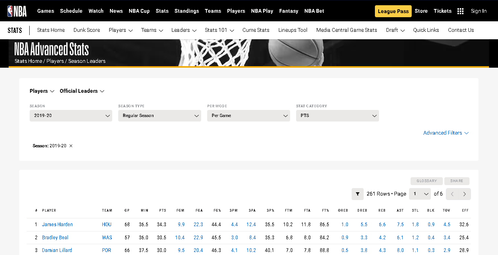

# NBA_Stats_Scraping

        
These project focuses on scraping NBA stats data using Python, specifically targeting the official NBA stats website.

## Key Steps in Data Scraping
1. Setting Up the Environment
Import necessary libraries:
	- Pandas for data manipulation
	- Requests for making HTTP requests
	- Time and NumPy for handling delays and creating random wait times during scraping to avoid being blocked by the server

2. Understanding the Data Structure
   - The data is accessed via an API endpoint, which returns data in JSON format
  
       
     
3. Scraping Process
   - Use the `requests.get()` method to fetch data from the constructed URL
      
       
     
4. Handling API Requests
   - To avoid being blocked, introduce a delay between requests using `time.sleep()`
  
      

5. Data Storage
   - Once the data is scraped, it is stored in a DataFrame, which allows for easy manipulation and analysis later

6. Output
   - The collected data can be exported to an Excel file for further analysis
